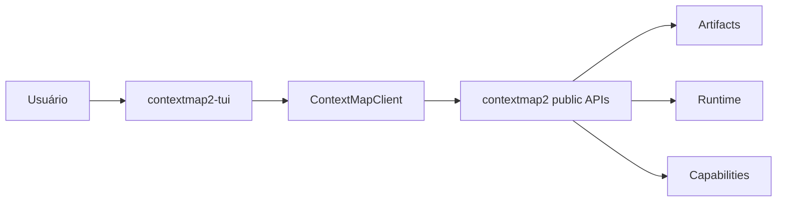

# ContextMap2 TUI

Interface terminal para explorar, configurar e operar o ContextMap2.

Este repositório é separado de `contextmap2` de forma intencional. A TUI possui apresentação, navegação, interação e experiência operacional. Contratos de domínio, semântica de artifacts, decoding de fontes, composição da pipeline e lógica científica continuam pertencendo ao core.

## Escopo

A evolução planejada é incremental:

1. fundação da aplicação Textual e boundary com o core;
2. Artifact Explorer para inspeção textual de sequências canônicas;
3. Ingestion Console para configurar e executar Ingestion;
4. Pipeline Console, quando `contextmap.runtime` expuser contratos estáveis para configuração, preflight e execução.



## Regras arquiteturais

- nenhum objeto ROS-nativo cruza para a TUI;
- nenhum SDK de modelo/backend pertence à TUI;
- não duplicar parsing de schemas quando existe reader público no core;
- screens/widgets não implementam lógica científica;
- a TUI não define uma segunda semântica de pipeline;
- operações longas não bloqueiam o event loop do Textual;
- capabilities indisponíveis na versão instalada do core aparecem como indisponíveis, sem fallback silencioso.

## Stack

- Python >= 3.11
- Textual >= 8.2, < 9
- pytest + pytest-asyncio
- Ruff
- mypy

## Desenvolvimento

```bash
python -m venv .venv
source .venv/bin/activate
python -m pip install -e '.[dev]'
make check
contextmap-tui
```

Para trabalhar com um checkout local do core:

```bash
python -m pip install -e ../contextmap2
python -m pip install -e '.[dev]'
```

## Fluxo Git

`main` é a branch estável de integração. Cada milestone é desenvolvida em uma branch dedicada criada a partir da `main` mais recente e só entra em `main` por Pull Request.

```text
main
  └── milestone/<slug>
          ├── commits das issues da milestone
          └── Pull Request -> main
```

Branches pequenas por issue são opcionais. O PR final da milestone é obrigatório.

Ver [docs/development.md](docs/development.md), [docs/architecture.md](docs/architecture.md) e [docs/roadmap.md](docs/roadmap.md).
