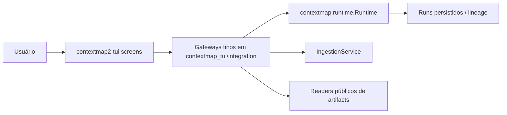

# ContextMap2 TUI

Interface terminal para explorar, configurar e operar o ContextMap2.

Este repositório é separado de `contextmap2` de forma intencional. A TUI possui apresentação, navegação, interação e experiência operacional. Contratos de domínio, semântica de artifacts, decoding de fontes, composição da pipeline e lógica científica continuam pertencendo ao core.

## Escopo

A TUI é um frontend fino sobre APIs públicas que já existem no ContextMap2:

| Área | API pública do core | Estado na TUI |
|---|---|---|
| Artifact Explorer | readers de `contextmap.ingestion` (`SequenceArtifact`) | implementado |
| Ingestion Console | `Runtime.resolve_config` → `Runtime.ingestion` → `IngestionService.preflight/run` | implementado ([#12](https://github.com/Alexandre-Tortoza/contextmap2-tui/issues/12), [#24](https://github.com/Alexandre-Tortoza/contextmap2-tui/issues/24)) |
| Pipeline Console | `Runtime.status/capabilities/resolve_config/resolve_plan/preflight/run` | implementado ([#15](https://github.com/Alexandre-Tortoza/contextmap2-tui/issues/15), [#16](https://github.com/Alexandre-Tortoza/contextmap2-tui/issues/16), [#17](https://github.com/Alexandre-Tortoza/contextmap2-tui/issues/17)) |
| Run Inspector | `Runtime.list_runs/inspect_run` | implementado ([#18](https://github.com/Alexandre-Tortoza/contextmap2-tui/issues/18)) |
| Saídas de etapas por contract | readers públicos de cada capability | pendente ([#25](https://github.com/Alexandre-Tortoza/contextmap2-tui/issues/25)) |
| ContextMap spatial memory | `contextmap.artifact.ContextMapArtifactReader` / `validate_context_map_artifact` | pendente ([#26](https://github.com/Alexandre-Tortoza/contextmap2-tui/issues/26)) |

O trabalho restante é adaptar a TUI a contratos públicos existentes, não esperar por APIs novas. Ver [docs/roadmap.md](docs/roadmap.md).



## Regras arquiteturais

- nenhum objeto ROS-nativo cruza para a TUI;
- nenhum SDK de modelo/backend pertence à TUI;
- não duplicar parsing de schemas quando existe reader público no core;
- screens/widgets não implementam lógica científica;
- a TUI não define uma segunda semântica de pipeline;
- operações longas não bloqueiam o event loop do Textual;
- capabilities indisponíveis na versão instalada do core aparecem como indisponíveis, sem fallback silencioso.

## Stack

- Python >= 3.11
- Textual >= 8.2, < 9
- pytest + pytest-asyncio
- Ruff
- mypy

## Desenvolvimento

```bash
python -m venv .venv
source .venv/bin/activate
python -m pip install -e '.[dev]'
make check
contextmap-tui
```

Para trabalhar com um checkout local do core:

```bash
python -m pip install -e ../contextmap2
python -m pip install -e '.[dev]'
```

Sem o core instalado, os testes de contrato (`tests/test_*_contract.py`, `tests/test_runtime_discovery.py`) são pulados e a suíte usa fakes determinísticos, como no CI. Para rodá-los contra um checkout local sem instalar:

```bash
PYTHONPATH=../contextmap2/src pytest
```

## Fluxo Git

`main` é a branch estável de integração. Cada milestone é desenvolvida em uma branch dedicada criada a partir da `main` mais recente e só entra em `main` por Pull Request.

```text
main
  └── milestone/<slug>
          ├── commits das issues da milestone
          └── Pull Request -> main
```

Branches pequenas por issue são opcionais. O PR final da milestone é obrigatório.

Ver [docs/development.md](docs/development.md), [docs/architecture.md](docs/architecture.md) e [docs/roadmap.md](docs/roadmap.md).
