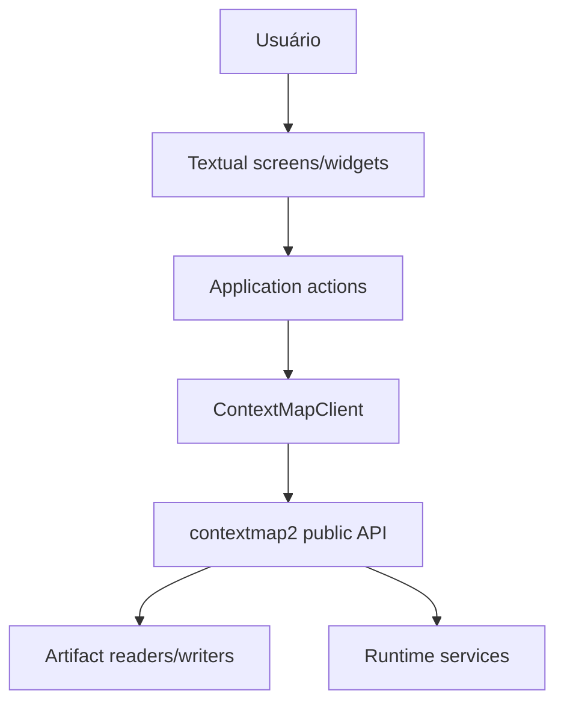

# Arquitetura

## Ownership

`contextmap2-tui` possui apresentação e interação. `contextmap2` possui contratos de domínio, semântica de artifacts, runtime composition, source decoding e processamento científico.

## Regra de dependência

A TUI pode depender da API pública do `contextmap2`. O core nunca depende deste repositório.

## Boundary do gateway

Uma camada pequena, conceitualmente `ContextMapClient`, isola screens/widgets dos detalhes da API do core. A UI consome view models ou valores Python simples. Testes podem substituir esse boundary por um fake determinístico sem ROS, modelos, bags ou workspace real.

O gateway não é service locator e não reproduz comportamento científico.

## Comportamentos proibidos

A TUI não deve:

- decodificar ROS/bags diretamente;
- importar backends concretos de percepção, state estimation ou modelos;
- implementar projeção, fusion, mapping, entity resolution ou outra lógica científica;
- duplicar schemas JSON quando readers públicos do core fornecem a mesma informação;
- definir um DAG/configuração independente de `contextmap.runtime`;
- escolher fallbacks silenciosos quando uma capability solicitada não está disponível.

## Operações longas

Textual Workers ou mecanismo equivalente podem coordenar operações demoradas sem bloquear o event loop. Progress, logs e interação são preocupações da UI. A semântica de cancelamento, reuse, resume e recompute pertence ao runtime/core.
