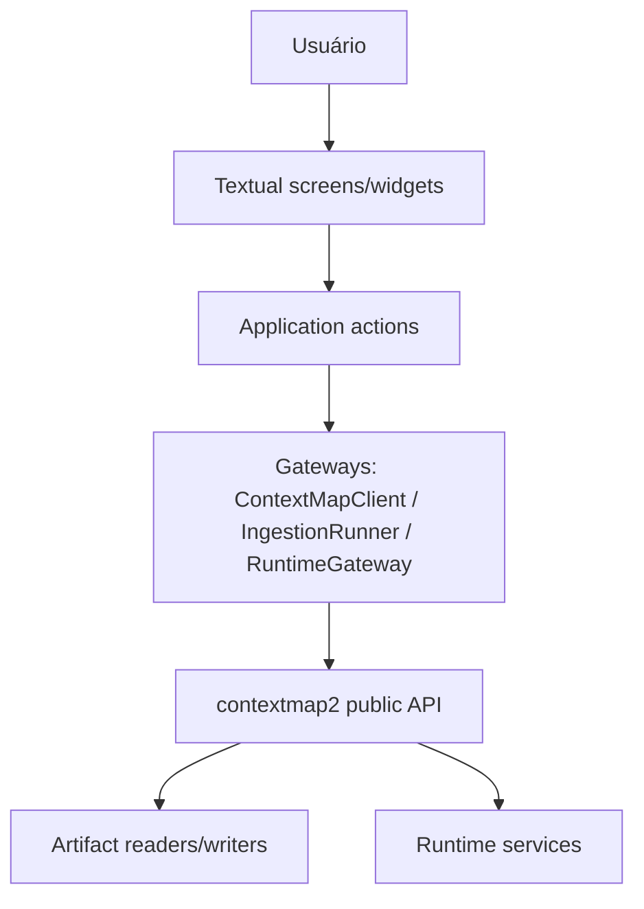

# Arquitetura

## Ownership

`contextmap2-tui` possui apresentação e interação. `contextmap2` possui contratos de domínio, semântica de artifacts, runtime composition, source decoding e processamento científico.

## Regra de dependência

A TUI pode depender da API pública do `contextmap2`. O core nunca depende deste repositório.

## Boundaries

Somente `contextmap_tui/integration` importa `contextmap` (verificado por `tests/architecture/test_boundaries.py`), e apenas pelas raízes públicas (`contextmap.runtime`, `contextmap.ingestion`, `contextmap.artifact`). Screens dependem de protocolos:

| Protocolo (`contextmap_tui`) | Adapter de produção | API pública |
|---|---|---|
| `client.ContextMapClient` | `LocalContextMapClient` | readers de `SequenceArtifact` |
| `ingestion.IngestionRunner` | `LocalIngestionRunner` | `Runtime.ingestion` / `IngestionService` |
| `runtime.RuntimeGateway` | `LocalRuntimeGateway` | `contextmap.runtime.Runtime` |

O `RuntimeGateway` transporta os valores públicos do core de forma opaca (`EffectiveConfig`, `ResolvedPipelinePlan`, `RuntimePreflightReport`, `RuntimeExecutionResult`, `RuntimeRunSummary`, `RuntimeRunRecord`, `ExecutionEvent`). A UI só lê seus atributos para renderizar; não existe schema paralelo de pipeline ou de run.

- Edições usam exclusivamente `RuntimeEdit.path` e a gramática de override `path=<json>`; após cada edição, configuração e plano são resolvidos de novo.
- Escopo (`targets`, `provided`, `catalog`), reuso (`Runtime.reuse_policy`) e resume são repassados ao runtime, que decide.
- `executors`, `providers` e `verifier` são argumentos públicos de `Runtime(...)` fornecidos por quem os possui (`LocalRuntimeGateway(runtime_options=...)`); a TUI nunca os constrói.
- Campos ausentes em um registro persistido aparecem como "unknown (not recorded)" junto das `notes` do runtime, nunca reconstruídos.

Testes de UI usam fakes determinísticos com o formato dos valores públicos (`tests/runtime_values.py`); testes de contrato rodam contra o core real quando instalado.

## Comportamentos proibidos

A TUI não deve:

- decodificar ROS/bags diretamente;
- importar backends concretos de percepção, state estimation ou modelos;
- implementar projeção, fusion, mapping, entity resolution ou outra lógica científica;
- duplicar schemas JSON quando readers públicos do core fornecem a mesma informação;
- definir um DAG/configuração independente de `contextmap.runtime`;
- escolher fallbacks silenciosos quando uma capability solicitada não está disponível.

## Operações longas

Textual Workers ou mecanismo equivalente podem coordenar operações demoradas sem bloquear o event loop. Progress, logs e interação são preocupações da UI. A semântica de cancelamento, reuse, resume e recompute pertence ao runtime/core.
