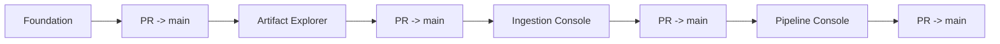

# Roadmap

A implementação está organizada em quatro milestones sequenciais.

## 1. Foundation & UI Architecture

Branch: `milestone/foundation`

Objetivo: estabelecer packaging, CI, shell Textual, navegação, gateway `ContextMapClient` e infraestrutura de testes determinísticos.

Saída esperada: aplicação instalável e navegável, ainda sem duplicar comportamento do core.

## 2. Artifact Explorer

Branch: `milestone/artifact-explorer`

Objetivo: permitir explorar sequences/artifacts, manifest, observações, provenance, calibração, synchronization, diagnostics e integridade por meio dos readers públicos do ContextMap2.

Saída esperada: inspeção textual completa de um `SequenceArtifact` sem reabrir o bag original.

## 3. Ingestion Console

Branch: `milestone/ingestion-console`

Objetivo: configurar fonte, topics, clocks, calibration e synchronization; executar Ingestion de forma não bloqueante; abrir o artifact persistido resultante.

Dependência: o core precisa expor uma API operacional estável para compor/executar Ingestion. A TUI não implementa um runner científico alternativo.

## 4. Pipeline Console

Branch: `milestone/pipeline-console`

Objetivo: descobrir capabilities instaladas, editar apenas a configuração suportada pelo runtime, executar preflight/stages/pipeline e inspecionar runs/lineage.

Dependência: contratos públicos de `contextmap.runtime` para discovery, `PipelineConfig`, preflight e execução.

## Regra de promoção

Cada milestone é implementada na sua branch e só chega em `main` por Pull Request após revisão e CI.

