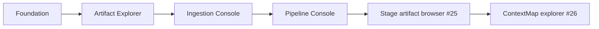

# Roadmap

Baseline do core: `contextmap2/dev`. As APIs públicas de runtime e Ingestion já existem; a TUI se adapta a elas.

## Perfis do runtime

`canonical/1` e `canonical/2` são topologias versionadas distintas, descobertas por `Runtime.status().profiles`. `canonical/2` estende `canonical/1` sem redefini-lo:

| Perfil | Etapas |
|---|---|
| `canonical/1` | `ingestion`, `visual_perception`, `state_estimation`, `geometric_mapping`, `sensor_association`, `point_representation` (opcional, desligada por padrão), `semantic_fusion` |
| `canonical/2` | tudo de `canonical/1` + `semantic_mapping`, `entity_resolution`, `spatial_relations` |

A TUI lê essa topologia de `Runtime.resolve_plan`; ela nunca constrói nem religa o DAG.

## Lacunas honestas reportadas pelo core

Estas lacunas pertencem ao core e aparecem na TUI exatamente como o runtime as reporta (`missing_executors`, problemas de preflight, runs `blocked`), sem executor substituto:

- `ingestion` não tem executor composto automaticamente: precisa de um `IngestionStageExecutor` injetado, ou o artifact publicado pela Ingestion Console entra como `provided`/`selections`;
- `visual_perception` só é composto com os quatro componentes selecionados e disponíveis, e backends de modelo precisam de `providers`;
- `point_representation` ainda não tem executor;
- `semantic_fusion` só tem executor para `baseline-evidence-accumulation-v1`;
- `semantic_mapping` não tem executor: seu artifact precisa ser fornecido;
- reuso e resume exigem um `verifier`, que só o dono dos executores pode fornecer (`LocalRuntimeGateway(runtime_options=...)`).

`ContextMapArtifact` existe e é legível/validável por `contextmap.artifact`, mas a montagem do ContextMap ainda **não** é uma etapa do runtime.

## Milestones

### Concluídas

1. **Foundation & UI Architecture** — packaging, CI, shell Textual, navegação e testes determinísticos.
2. **Artifact Explorer** — inspeção textual de `SequenceArtifact` pelos readers públicos.
3. **Ingestion Console** — request público `IngestionRequest`, preflight e execução via `IngestionService`, cancelamento cooperativo e reabertura do artifact publicado ([#12](https://github.com/Alexandre-Tortoza/contextmap2-tui/issues/12), [#24](https://github.com/Alexandre-Tortoza/contextmap2-tui/issues/24)).
4. **Pipeline Console** — discovery por perfil ([#15](https://github.com/Alexandre-Tortoza/contextmap2-tui/issues/15)), editor guiado por `ResolvedPipelinePlan.editable` ([#16](https://github.com/Alexandre-Tortoza/contextmap2-tui/issues/16)), preflight/execução/reuso/resume/cancelamento ([#17](https://github.com/Alexandre-Tortoza/contextmap2-tui/issues/17)) e inspeção de runs persistidos ([#18](https://github.com/Alexandre-Tortoza/contextmap2-tui/issues/18)).

Branch de integração atual: `milestone/public-core-integration`.

### Próximas

5. **Stage artifact browser** ([#25](https://github.com/Alexandre-Tortoza/contextmap2-tui/issues/25)) — abrir qualquer saída registrada em um run pelo contract público (`ArtifactRef.contract`), com tela explícita para contracts desconhecidos. Depende dos readers públicos de cada capability.
6. **ContextMap spatial-memory explorer** ([#26](https://github.com/Alexandre-Tortoza/contextmap2-tui/issues/26)) — explorer somente leitura de `ContextMapArtifact` via `ContextMapArtifactReader` e `validate_context_map_artifact`, preservando hipóteses, incerteza e proveniência. Geração/montagem fica fora de escopo até o core expô-la.

## Regra de promoção

Cada milestone é implementada na sua branch e só chega em `main` por Pull Request após revisão e CI.

